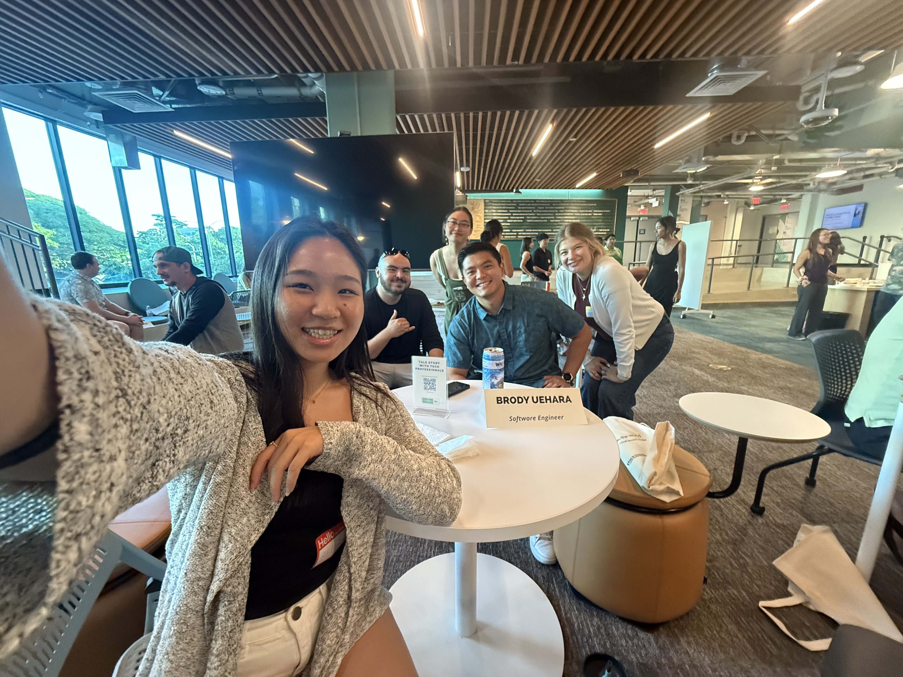

## A Unique Networking Experience

Attending the Tech Minds Meetup was an eye-opening experience that gave me the chance to network with software engineers, product managers, and tech professionals from local and mainland companies. The event was set up in a format where we rotate between different professionals every 15 minutes. It felt a little like a blind date, but instead of personal conenctions, we were making professional ones. 

As a Computer Science and Business student, I am still exploring different career paths, so I was excited to hear first hand advice from professionals who have experience in the industry. Throughout the evening, I was able to speak with four different individuals, each of whom shared unique insights about product management, software engineering, programming languages, internships, and career growth. Their advice not only gave me new perspectives and inputs but also helped me clarify my next steps in preparing for my future career.

## Discovering Product Management and the Importance of Early Experience

In the first round, I met a local engineer who specializes in product management. Right away, he asked me about my interests and what I wanted to do with my computer science and business degree. I admitted that I was still uncertain of my ideal career and am still exploring different paths, which he then introduced me to the world of product management. 

He explained that product managers act as a bridge between engineering, design, and business teams. Their purpose is to guide product developments, making sure that they are not only functional but also useful and marketable. He told me that product managers are technically competent but then shift their energies into fixing user problems, leading teams, and making strategic decisions. This caught my attention right away because I am a huge fan of both business and technology, and product management seems like a career that incorporates both fields. 

One of the most interesting things he also mentioned was how he uses AI technology to assist in coding and product development. He described how AI can automatically perform repetitive tasks, generate code snippets, and even analyze and scan the market trends, which allows him to focus more on the creative and strategic aspects of his work. This made me realize that creating products isn't just about programming—it's also about understanding user needs, designing good experiences, and making data-driven decisions.

As our conversation shifted, I asked for some advice on how to get started with my computer science journey, particularly about internships. Until then, I wasn’t sure when or where to start, but he encouraged me to begin as soon as possible. He told me that companies value experience, so although I am still in my second year, it is better to start early so that my resume would look more professional. This totally made a lot of sense because I’ve realized that experience is everything in the tech industry. It’s not just about completing assignments in class—it’s about applying my knowledge in the real world.

He also recommended that I start working on a project, even if it’s something small. When I asked how big or complex my project should be, he reassured me that anything I enjoy doing is fine. The goal is simply to have something to showcase my skills. Over time, I can expand my project or collaborate with others, but what matters most is getting started. I’ve always hesitated to start on anything but it made me think that I don’t need to wait for the perfect idea—I just need to start working on something I find interesting and build from there.
This conversation was really meaningful, and it gave me a clear direction on how to gain experience outside of class. I now feel motivated to start exploring internships and working on personal projects to develop my skills further.

## Software Engineering, Python, and Career Growth

In the second round, I had the opportunity to meet two software engineers, including Brody Uehara, who is currently a Software Engineer (SWE) at kWh Analytics and the founder of Mana Technologies. It was interesting to learn that he grew up locally in Hawaii but now works in San Francisco’s tech industry.

Since my friends and I are studying computer science, our conversation naturally shifted toward programming languages. We had fun talking about our most favorite and least favorite programming languages (and of course about TypeScript) too! Brody shared his thoughts on the languages and advised us to learn Python, calling it one of the easiest and most versatile languages to pick up. He explained how Python is widely used in software development, automation, and even artificial intelligence, which aligns with some of the industry’s biggest trends.

Beyond programming, we also discussed what it’s like to be an engineer in the field. Brody mentioned that software engineering isn’t just about writing code—it’s also about problem-solving, collaboration, and constantly learning new technologies. He emphasized the importance of understanding how systems work, debugging efficiently, and writing code that scales. One of the things that stood out to me was his advice about balancing technical skills with communication skills, since software engineers often have to work with product managers, designers, and other teams.

This conversation made me realize that being an engineer is more than just coding—it's about solving real-world problems and adapting to new tools and technologies. It also gave me the idea that even though there are some languages that may not be our favorite, learning the different technologies can be valuable for our careers. 

## Moving Forward with Confidence

Attending the Tech Minds Meetup felt like a very valuable experience that gave me insightful advice and new perspectives on my career in technology. Speaking with professionals in product management and software engineering helped me understand the various paths I can take with my Computer Science and Business degree. I learned that starting early—whether through internships or personal projects—is important and something that I need to think more about for building real-world experience beyond the classroom.

Through conversation, it also made me realize that the tech world is not just about programming, but it is also about problem-solving, teamwork, and adaptability. The idea of using AI in product development opened my eyes to new possibilities, while the emphasis on communication skills for engineers showed me the importance of being able to collaborate across different teams.

Overall, this event reinforced my motivation to start building my experience now. I plan to begin working on projects that interest me, explore internship opportunities, and continue learning new technologies. I truly believe that the advice I received today at this event will stay with me as I continue navigating my path in the tech and business industry!

*This essay was reviewed using AI(ChatGPT) for grammar checking to ensure and correctness and improve readability.*
