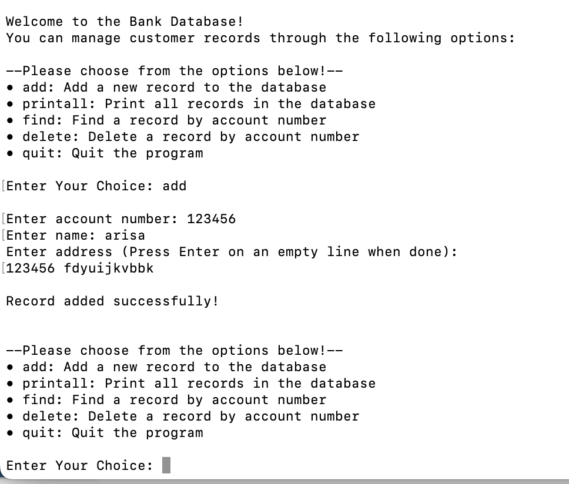

## Project Overview  
This project is a **C-based bank record management system** that allows users to **add, search, modify, and delete bank records** stored in a linked list. The system ensures efficient memory usage and provides a user-friendly interface for handling records dynamically. The program operates through a menu-driven interface, allowing users to interact with the database easily.  

The project focused on fundamental concepts such as **linked lists, dynamic memory allocation, and structured programming**. It also required careful implementation of **input validation and error handling** to ensure smooth execution and data integrity. Debugging was an essential part of development, and special attention was given to identifying memory leaks and handling segmentation faults.  

The final system supports:  
- Adding a new bank record with an account number, name, and address.  
- Searching for a record by account number.  
- Modifying existing records.  
- Deleting a record from the database.  
- Printing all stored records.  

---

## Data Structures & Code Implementation 

### Inserting a Record into the Database 
The database.c file is responsible for managing the bank records using a linked list. It contains all the core functions that handle data operations, such as adding, finding, modifying, deleting, and printing records. Since the program must store records dynamically, it uses linked lists to manage memory efficiently. Each record is stored in a struct containing the following fields:  

- `accountno` – Unique integer identifier for each bank account.  
- `name` – Character array to store the account holder’s name.  
- `address` – Multi-line address stored as a character array.  
- `next` – Pointer to the next record in the linked list.

The code below is a part of my code where it shows how the new data is added to the database in a specific order so that it prevents duplications. 

```c
/*****************************************************************
//
//  Function name: addRecord
//
//  DESCRIPTION:   Adds a new record to the database in sorted order
//                while preventing duplicates.
//
//  Parameters:    start (struct record **) : Pointer to the start of the list
//                accountno (int)          : Account number to add
//                name (char [])           : Account holder's name
//                address (char [])        : Account holder's address
//
//  Return values: 0 : Success
//                -1 : Duplicate account number found
//
*****************************************************************/

int addRecord(struct record **start, int accountno, char name[], char address[]) 
{
    struct record *temp, *current, *previous = NULL;

    temp = (struct record *) malloc(sizeof(struct record));

    if (temp == NULL) 
    {
        printf("Memory allocation failed.\n");
        return -1;
    }

    temp->accountno = accountno;
    strcpy(temp->name, name);
    strcpy(temp->address, address);
    temp->next = NULL;

    if (*start == NULL) 
    {
        *start = temp;
    } 
    else 
    {
        current = *start;

        while (current != NULL && accountno > current->accountno) 
        {
            previous = current;
            current = current->next;
        }

        if (current != NULL && accountno == current->accountno) 
        {
            free(temp);
            return -1;
        }

        if (previous == NULL) 
        {
            temp->next = *start;
            *start = temp;
        } 
        else 
        {
            temp->next = previous->next;
            previous->next = temp;
        }
    }

    return 0;
}
```
### Processing User Input for Adding a Record
The user_interface.c file is responsible for handling all user interactions with the bank database system. It provides a menu-driven interface, allowing users to add, search, modify, delete, and print bank records. This file also ensures input validation to prevent incorrect user input and manages multi-line address input using fgetc().

The code below is an example of how it handles the addition of a new bank record when the user selects "add". It first validates the account number, ensuring it is a positive integer. If the input is invalid, the user is prompted to try again. This code ensures valid user input, proper address handling, and smooth interaction between user input (user_interface.c) and data storage (database.c).

```c
int main(int argc, char *argv[]) 
{    
    struct record *start = NULL;
    char option[10];
    int len;
.
.
.

if ((strncmp(option, "add", strlen(option)) == 0) && strlen(option) <= 3)
{
    char name[25];
    char address[1000];
    int accountno = -1, result;
    char extraletters;

    /* Validate account number */
    while (accountno <= 0)
    {
        printf("\nEnter account number: ");
        result = scanf("%d%c", &accountno, &extraletters);
        if (result != 2 || extraletters != '\n' || accountno <= 0)
        {
            printf("\nError: Account number must be a positive integer.\n");
            accountno = -1;
            while (getchar() != '\n');
        }
    }

    /* Get name */
    printf("Enter name: ");
    fgets(name, sizeof(name), stdin);

    /* Remove trailing newline from name */
    int len = strlen(name);
    if (len > 0 && name[len - 1] == '\n')
    {
        name[len - 1] = '\0';
    }

    /* Collect multi-line address using getaddress() */
    address[0] = '\0';
    getaddress(address, 1000);

    /* Call addRecord function */
    addRecord(&start, accountno, name, address);
    printf("Record added successfully!\n\n");
}
```
This part ensures that invalid account numbers don’t crash the program and it shows how getaddress() is used to handle multi-line inputs.

### Example Interaction: Adding a New Record
Below is an example of the program output when a user selects the "add" option to add a new bank record:

<div style="text-align: center;">
    
</div> 


### My Role & Contributions
I worked on several key parts of the project, including user-interface functions, input validation, and linked list operations. My main tasks were designing and coding the add, search, modify, delete, and print functions to handle bank records efficiently and keep everything organized.

I also made sure memory was allocated and freed properly to avoid issues like memory leaks. Debugging was a big part of my work—I used gdb and print statements to figure out problems like segmentation faults and memory errors. I created input validation to make sure user inputs, especially multi-line addresses, worked without causing errors. I also wrote a test plan (testplan.xlsx) and documentation (summary.txt) to check that the program ran as expected.

Adding a debug mode was one of the more challenging parts. It let users see what was happening behind the scenes, which made troubleshooting easier. Overall, I focused on making the program simple to use, well-organized, and reliable.

### Lessons Learned & Skills Gained
This project helped me get better at managing linked lists, working with dynamic memory, and debugging in C. I learned a lot about how pointers work and how to handle memory safely to avoid problems like memory leaks.

I also got better at problem-solving and debugging by using gdb to fix issues like segmentation faults. Breaking the project into smaller functions made it easier to debug and test, and creating a test plan helped me catch unexpected behaviors before finishing the program.

Writing documentation showed me how important it is to explain things clearly so others can understand and use the program. Overall, this project gave me confidence in building structured, efficient, and reliable programs in C.
