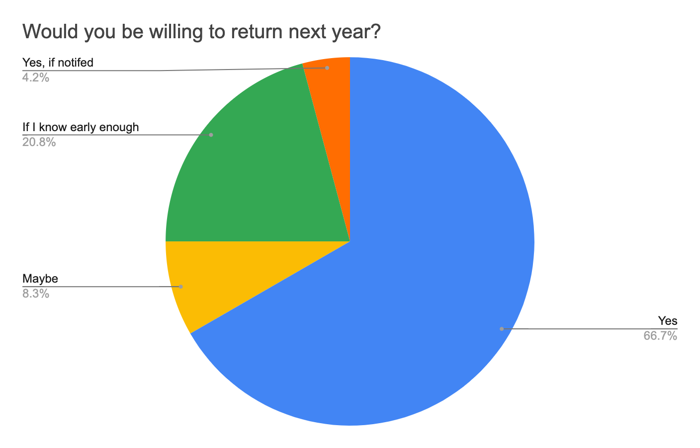

## Project Overview  
The Noelani Craft & Children’s Fair is an annual fundraising event that supports school programs, including music, PE, enrichment activities, technology, and facility improvements. The event relies heavily on vendor participation to generate revenue, but in previous years, vendor engagement was inconsistent due to factors such as high participation fees, lack of targeted outreach, and competition from other local events.  

The objective of this project is to increase vendor participation by at least 10% for the next fair through strategic marketing techniques and cost reduction measures. The two major strategies in this project will involve lowering vendor fees and using social media marketing. Lowering the vendor fees by at least 20% will remove any financial barriers that deter small businesses and first-time vendors from participating. Moreover, we make very conscious and effective use of social media on Instagram, Facebook, and YouTube for creating awareness and capturing more prominent and larger audiences of both vendors and attendees.

These put together serve to ensure maximum possibility for increased vendors, fundraising opportunities, and community involvement. This project's outcome would be measured by vendor surveys, attendance, and analytics from our digital marketing efforts.

---

## Data & Market Research  

To further and better understand the challenges in vendor participation, some vendor surveys were conducted to analyze past event data. The responses provided a good insight into key factors related to pricing and promotional effectiveness for understanding vendor expectations for participation in the events.

### Vendor Attendance Insights  
  

Survey results indicated that only 40.9% of the responding vendors had visited the fair previously. Most vendors mentioned concerns about the pricing, saying that participation fees were a little too high for a small business to afford. Additionally, vendors were hoping for more targeted promotional efforts to increase customer turnout. 

### Impact of Vendor Fees on Participation  

The most striking of these was the effect of vendor fees on participation rates. Pricing analysis indicated that a reduction in vendor fees by at least 20% would significantly increase participation. Some vendors were required to pay upwards of $500 to attend similar events, while others paid approximately $90. The difference in fees showed immediately that some other, more flexible pricing might allow for inclusion and attract at least a wider range of different vendors. 

Our analysis also indicated that most of the vendors expressed interest in digital outreach effort in order to drive customer traffic; for instance, informative digital posters and promotional videos work better compared to traditional flyers because they reach more audiences and are likely to capture the attention of prospective attendees more.

---

## My Role & Contributions  

I led the market research and analysis of vendors to identify the key challenges that prevented the vendors from attending the fair. My responsibilities included designing and distributing vendor surveys, analyzing trends in participation, and developing strategies to address concerns from vendors. From the results of the survey, I came up with a pricing model that would reduce the financial barriers at a reasonable, yet profitable, level for the event.

I also worked out the digital marketing strategy for the event. It included designing and implementing a social media campaign aimed at attracting vendors and raising general awareness about the fair. This involved designing the digital ads, creating multiple contents for each social media platform such as Instagram and Facebook, and developing a plan to track the engagements of each platforms in order to find out the effectiveness of the campaign.

Additionally, I participated in the evaluation phase of the project. This involved me and my peers to analyze post-event survey responses and comparing vendor turnout to previous years to assess the success of our initiatives. Through these steps, I helped identify areas where we need to improve for future fairs buy considering vendor's voices and utilizing digital marketing efforts.

---

## Lessons Learned & Skills Gained  

This project helped me gain a deeper insight into marketing strategy, consumer behavior, and event planning. I understood how to conduct and interpret a survey, find meaningful trends, and utilize data in decision-making. I also utilized my skill in strategic communications, having to present our report and recommendations in a persuasive and actionable format to be able to convince others of our research.

Apart from analysis, this project helped me gain a deeper understanding of social media marketing and social outreach techniques. I gained hands-on experience in producing promotional materials, crafting effective web content, and utilizing analysis to track advertisement effectiveness. Having the ability to track social performance and make adjustments in terms of engagement statistics was a critical skill I gained through this exercise.

Lastly, this was my very first big Business related project where I develop my collaboration and leadership skills. Negotiating with event coordinators, vendors, and school representatives involved balancing competing perspectives and reconciling marketing strategies with competing sets of requirements. Learning to make accommodations in terms of real-life feedback was a critical lesson I derived out of this exercise.

---
