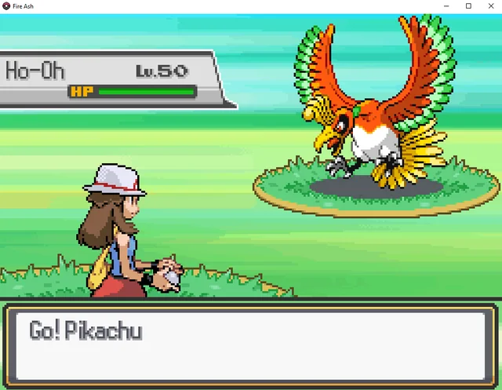

                
## Project Overview  
This project is a Pokémon information database system with provisions for saving and loading Pokémon information (name and level) via file I/O operations in C, with a strong bias towards binary file operations for storing and reading in a structured format, with persistent state between executions of a program.

The project involved creating significant functions for saving and reading in a structured format with `fwrite()` and `fread()`, with utmost care in storing Pokémon records in a proper format and reading them out accurately. Testing included custom-designed test drivers for file operations and integrity of information saved and loaded.

The final system supports:  
- Writing Pokémon data to a binary file (`writefile` function).  
- Reading Pokémon data from the file (`readfile` function).  
- Ensuring structured data storage and retrieval.  
- Handling errors like missing or corrupted files.  

---

##  **Writing and Reading Pokémon Data (iofunctions.c)**

The `writefile` function is responsible for storing Pokémon records into a binary file. Each Pokémon has a name (stored as a character array) and a level (stored as an integer). The function ensures that the data is written in a structured format.

```c
/*****************************************************************
//
//  Function name: writefile
//
//  DESCRIPTION:   This function writes the Pokemon data stored 
//                 in the array to a file. If the file exists, 
//                 then it will be overwritten.
//
//  Parameters:    pokearray (struct pokemon[]) : array of Pokemon to write
//                 num (int)                    : number of Pokemon to write
//                 filename (char[])            : name of the file to write to
//
//  Return values:  0 : success
//                 -1 : error (file could not be opened)
//
****************************************************************/

int writefile(struct pokemon pokearray[], int num, char filename[])
{  
    /* Open the writefile (file will be overwritten if already exists) */
    FILE *pokemonFile = fopen(filename, "w");
    
    int i = 0;

    /* Check if file was successfully opened */
    if (pokemonFile == NULL) 
    {
        return -1; /* return if file could not be opened */
    }
    
    /* Loop the array of pokemons and write their data to the file */
    for (i = 0; i < num; i++) 
    {
        fprintf(pokemonFile, "%d\n", pokearray[i].level); /* Write the Pokemon's level */
        fprintf(pokemonFile, "%s\n", pokearray[i].name); /* Write the Pokemon's name */
    }
    
    /* Close the file so that all of the data is written */
    fclose(pokemonFile);
    return 0;
}

```
The `readfile` function retrieves Pokémon records from a binary file and stores them in an array.

```c
/*****************************************************************
//
//  Function name: readfile
//
//  DESCRIPTION:   This function reads the Pokemon data from a file
//                 and stores it in an array. It stops reading if it 
//                 reaches the maximum array size or the end of the 
//                 file. 
//
//  Parameters:    pokearray (struct pokemon[]) : array to store Pokemon data
//                 num (int*)                   : pointer to the number of Pokemon
//                 filename (char[])            : name of the file to read from
//
//  Return values:  0 : success
//                 -1 : error (file could not be opened)
//
****************************************************************/

int readfile(struct pokemon pokearray[], int *num, char filename[])
{
    int i = 0; /* Counter to how many pokemons have been read so far */

    /* Open the readfile (read it from an existing file) */
    FILE *pokemonFile = fopen(filename, "r");

    /* If fopen returns NULL, then the file was unable to open so return -1 */
    if (pokemonFile == NULL) 
    {
        return -1;
    }

    /* Loop through to read the data from the file. Either read the max number of pokemons or until it reaches the end of the file */
    while (i < *num && fscanf(pokemonFile, "%d\n", &pokearray[i].level) != EOF && fgets(pokearray[i].name, sizeof(pokearray[i].name), pokemonFile) != NULL) 
    {
        /* Remove the newline character from the name, if there is one */
        if (pokearray[i].name[strlen(pokearray[i].name) - 1] == '\n')
        {
            pokearray[i].name[strlen(pokearray[i].name) - 1] = '\0';
        }
        i++;
    }
    
    /* Update the num variable so we can see how many pokemons were read */
    *num = i;
    
    /*Close the file to make sure that all the data is saved and is properly closed */
    fclose(pokemonFile);

    return 0;
}
```
---
##  **Example Output**

Below is an example of how the program writes Pokémon data to a file and retrieves it using `writefile` and `readfile`. The program first stores three Pokémon records and then reads them back, displaying the retrieved data.

```
==== Test Case 1 ====
Calling writefile with 3 pokemons, filename: 'pokemons1.txt'
writefile returned: 0
Successfully wrote 3 pokemons to 'pokemons1.txt'

Calling readfile to read pokemons from 'pokemons1.txt'
readfile returned: 0
Successfully read 3 pokemons from 'pokemons1.txt'
Pokemon 1 - Level: 19, Name: Pikachu
Pokemon 2 - Level: 81, Name: Eevee
Pokemon 3 - Level: 24, Name: Sylveon

==== Test Case 2 ====
Calling writefile with 3 pokemons, filename: 'pokemons2.txt'
writefile returned: 0
Successfully wrote 3 pokemons to 'pokemons2.txt'

Calling readfile to read pokemons from 'pokemons2.txt'
readfile returned: 0
Successfully read 3 pokemons from 'pokemons2.txt'
Pokemon 1 - Level: 150, Name: Skitty
Pokemon 2 - Level: 220, Name: Happiny
Pokemon 3 - Level: 100, Name: Jigglypuff
```
---
###  **My Role & Contributions**
In the project, I had to implement file I/O operations (`writefile` and `readfile`) in `iofunctions.c` so that it would properly store and print the Pokémon characters' informations appropriately. I implemented  the `driver.c`, which is a testing program to make sure the file operates when storing random Pokémon records, reading them, and testing for file not present and file corrupt errors. I created file structures, error scenarios, and debugging for incorrect format in Pokémon information and for data persistence so that users can better utilize it. To confirm that the program executed in an expected manner, I developed testing scenarios and documented output in `output.txt`.

###  **Lessons Learned & Skills Gained**
This project helped me assemble my understanding of manipulating binary files in C and develop my skill in structured programming and debugging file defects. I acquired an effective manipulation of information in a structured form with `fwrite()` and `fread()`, debugging defects such as un readable files, and file operations testing through orderly checking. I developed practice in developing module programs, with function decomposition into individual files (`iofunctions.c` and `driver.c`), in a form in which the program became maintainable and organized. I developed a profound realization of how real programs store and access information in a persistent manner with a profound understanding of file and structured programming fundamentals.
